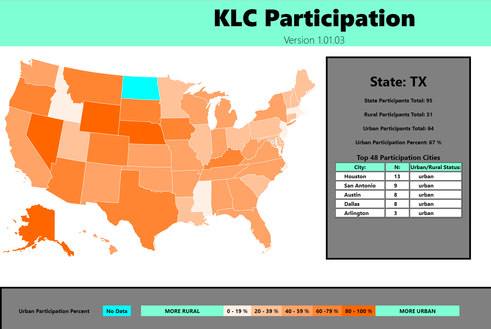

# KLS Heat Map

## Table of Contents

[Description](#description)

[Tools](#tools)

[Deployed_Application](#deployed-application)

[Future_Developments](#future-developments)

[Screenshots](#screenshots)

## Description

This front-end react application is used to look at the participation in Kidney Learning Center Activities for the National Kidney Foundation. Users can interact with the app by selecting individual states, which then populateds the gray section with relevant information. The user can then see the breakdown of Urban vs Rural participation, as well as see the top five particiaption cities (detailed with their total N and Urban/Rural status).

## Tools

* JavaScript
* React.js
* CSS
* Node.js

## Deployed Application

The deployed application can be found at https://bsovic23.github.io/kls-heat-map/

## Future Developments

* Add a back end server to allow for direct update of data
* Add city/zip code "heat map" to the homepage application
* Add navbar with version tab history, in depth city analysis
* Add functionality to look by region

## Screenshots

